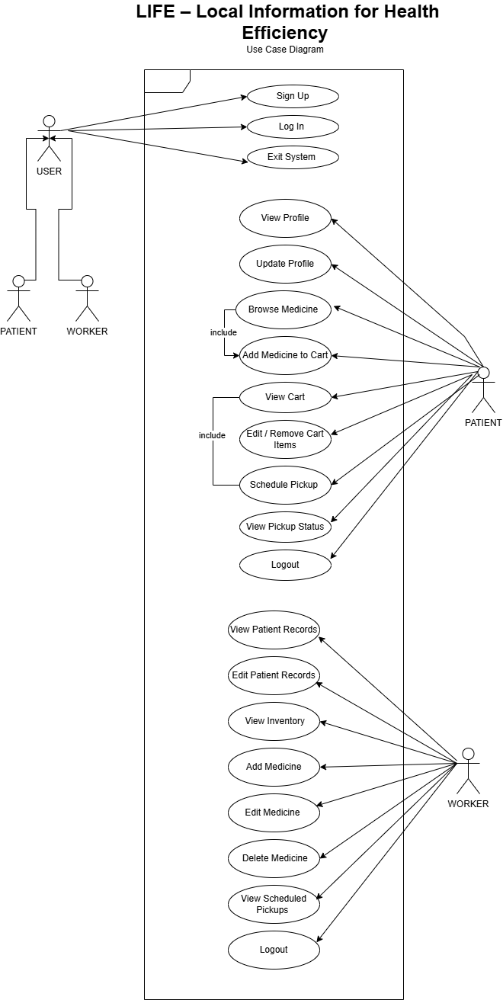

# SE-LIFE

# 🏥 LIFE – Local Information for Health Efficiency

**Team Members:**  
- **Lyka Mae Entera** *(Project Leader)*  
- **Kea Abaquita**  
- **Pantine Hernando**  

**Date Started:** September 07, 2025  
**Expected Completion:** December 08, 2025  

---

## 📘 Project Overview

**LIFE (Local Information for Health Efficiency)** is a **web-based barangay health tracking system** designed for **Barangay Duljo Fatima**. It enables health workers to manage patient records efficiently through a secure and user-friendly platform. The system replaces manual record-keeping, reduces errors, and improves accessibility to vital health data.

**🆕 Now with Cloud Database Support!** The system supports both SQLite (local development) and MySQL (cloud deployment with Aiven) for real-time synchronization across multiple users.

---

## 🎯 Objectives

**Main Goal:**  
To develop an efficient and reliable **health record management system** for Barangay Duljo Fatima.

**Specific Objectives:**
- Allow health workers to **record, update, and retrieve** patient data using a web interface.  
- Implement **search, sorting, and filtering** functions for quick record access.  
- Ensure **data security and privacy** through login authentication and confirmation dialogs.  

---

## 🧭 Scope

### ✅ In-Scope
- Add, edit, view, and delete patient records.  
- Sorting and filtering by patient ID, name, age, and gender.  
- Confirmation dialogs for sensitive actions.  
- Web interface accessible via desktop browsers.  

### ❌ Out-of-Scope
- Native mobile application.  
- Integration with national DOH systems.  
- Advanced analytics or report generation.  

---

## 👥 Stakeholders

- **Primary Users:** Barangay health workers and staff of Barangay Duljo Fatima.  
- **Other Stakeholders:** Barangay officials, patients (indirect beneficiaries), and IT mentors/advisors.  

---

## 👩‍💻 Team Contributions

| Member | Role | Tools Used | Primary Contributions |
| :--- | :--- | :--- | :--- |
| **Lyka Mae Entera** | **Project Leader & Backend Developer** | VS Code, Python/Flask | Server-side logic, API integration, code structure, and backend functionality. |
| **Kea Abaquita** | **UI/UX Designer & Frontend** | Figma, HTML, Tailwind CSS | User interface design, prototyping, wireframes, and frontend implementation. |
| **Pantine Hernando** | **System Analyst** | draw.io, UML Tools | System architecture, database design (ERD), flowcharts, and use-case modeling. |   

---

## ⚙️ System Requirements

### Functional Requirements
- Add, view, edit, and delete patient records.  
- Sort and filter records by name, ID, gender, or age.  

### Non-Functional Requirements
- Responsive and user-friendly interface.  
- Secure and reliable data handling. 

---

## 🧩 System Design

### Architecture Overview
- **Frontend (UI):** Patient dashboard, forms, sorting tools.  
- **Backend:** Flask server for CRUD operations.  
- **Database:** SQLite/MySQL for storing patient data.  
- **Security:** Authentication, confirmation dialogs, data validation.  

### Technologies Used
- **Backend:** Python (Flask, Jinja2)  
- **Frontend:** HTML, Tailwind CSS, JavaScript
- **Database:** SQLite / MySQL, Aiven
- **Deployment:** Render

---

## 🧾 UML Use Case Diagram

Below is the UML Use Case Diagram illustrating the interactions between the **Barangay Health Worker** and the **LIFE System**.



## 🧾 UML Use Case Summary

### **Main Actor**
Barangay Health Worker – manages all patient-related operations.

### **Key Use Cases**
| Use Case | Description | Trigger |
|-----------|--------------|----------|
| **Manage Patient Records** | Add, view, edit, or delete patient data. | User selects “Manage Records” from the dashboard. |
| **Add Patient Record** | Record new patient data into the system. | Clicks “Add Patient.” |
| **Edit Patient Record** | Modify existing patient details. | Clicks “Edit” beside a record. |
| **Delete Patient Record** | Remove outdated or incorrect records. | Clicks “Delete” and confirms. |
| **View Patient Record** | Display complete details of a patient. | Clicks “View” beside a record. |
| **Search and Filter Records** | Search or filter by name, ID, gender, or age. | Enters keyword or applies filters. |
| **Navigate System** | Move between Home, Patient Records, and About pages. | Clicks navigation buttons. |
| **Display Confirmation Dialogs** | Confirm or cancel sensitive actions (e.g., Delete, Save). | Performs an action requiring confirmation. |
| **Order Medical Items (Cart/Marketplace)** | Patients can order medical supplies such as medicines, thermometer, etc. | Patient opens Marketplace and adds items to cart. |
| **Request Medical Services** | Patients can request services like dental, vaccination, check-ups, etc. | Patient submits a service request form. |
---

## ⏱️ Project Timeline

| Phase | Duration | Description |
|-------|-----------|-------------|
| **Week 1** | Sept 7–13 | Finalize SDG focus and request Barangay approval. |
| **Week 2** | Sept 14–20 | Website draft and initial setup. |
| **Weeks 3–4** | Sept 21–Oct 18 | Page development and function implementation. |
| **Weeks 5–8** | Oct 19–Nov 30 | Debugging, refinement, and feature polishing. |
| **Week 9** | Dec 1–8 | Final testing, documentation, and submission. |

## ⚠️ Risks & Mitigation

| Risk | Mitigation |
|------|-------------|
| Delay in Barangay approval for testing | Maintain consistent communication and follow-ups. |
| Bugs or system errors | Conduct thorough testing and debugging at every stage. |

---

## 🧪 Testing & Quality Plan

**What to Test**
- Navigation, button functionality, and data flow.  
- Sorting and filtering accuracy.  
- Data saving, retrieval, and deletion processes.  

**How to Test**
- Manual UI and functionality testing.  
- Feedback sessions with Barangay health workers.  

---

## 📦 Deliverables

- ✅ Fully functional **Barangay Health Record Management System (LIFE)**  
- 📘 Complete **Documentation** (Use Case, UML, and User Guide)  
- 🗄️ **Cloud Database Integration** with MySQL/Aiven support
- 

---

## 🚀 Quick Start

### Local Development (SQLite)
```bash
# Install dependencies
pip install -r requirements.txt

# Run the application
python app.py
```

### Production with MySQL (Aiven)
See [MIGRATION_SUMMARY.md](MIGRATION_SUMMARY.md) for complete setup instructions.

**Quick Steps:**
1. Set up Aiven MySQL database
2. Set environment variables
3. Run `python test_connection.py` to verify
4. Run `python init_mysql_db.py` to initialize
5. Deploy to Render

**Default Credentials:**
- Admin: ID=`ADMIN123`, Password=`password`
- Patient: Username=`1`, Password=`password`

---

## 🧠 Summary

**LIFE** aims to enhance healthcare service efficiency in Barangay Duljo Fatima by transitioning from manual to digital health records. This system empowers health workers with organized, secure, and easily accessible patient information—supporting better decision-making and faster medical response in the community.
